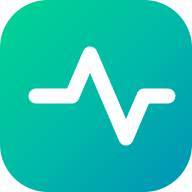
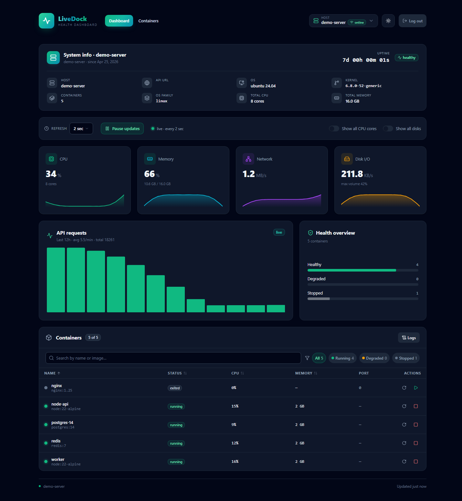
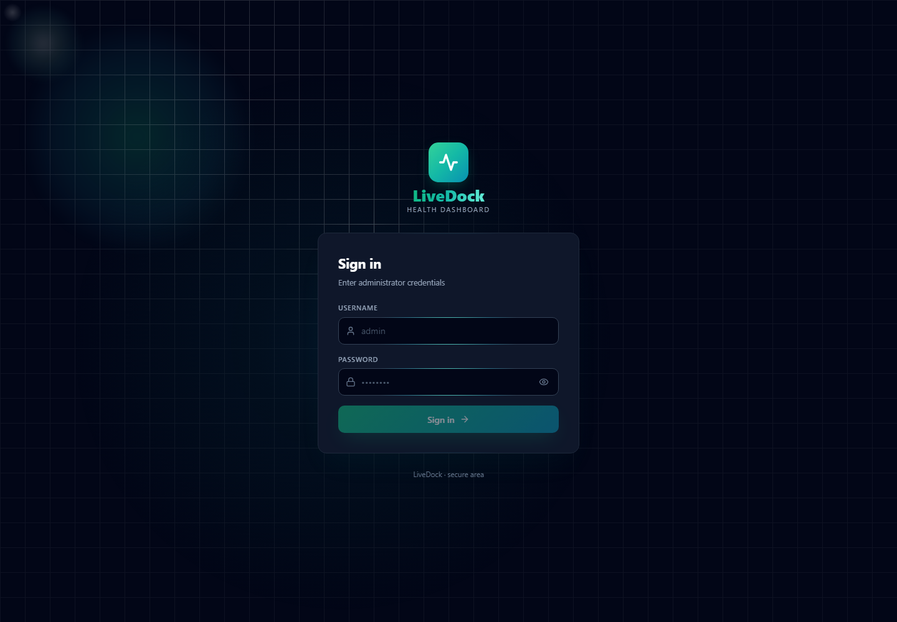
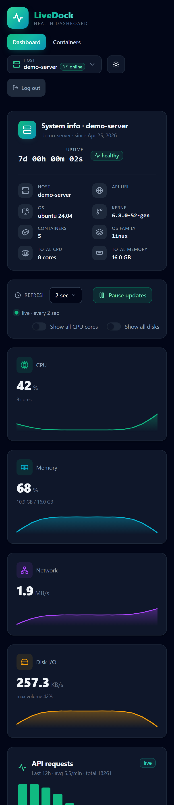

<p align="center">
  
</p>

<h1 align="center">LiveDock Dashboard</h1>

<p align="center">
  Self-hosted server and container monitoring with a calm, signal-first interface.
</p>

<p align="center">
  <a href="https://homepage-opal-pi.vercel.app"><strong>Open the live demo</strong></a>
  ·
  <code>demo</code> / <code>demo</code>
</p>

<p align="center">
  <a href="https://vuejs.org/"></a>
  <a href="https://nuxt.com/"></a>
  <a href="https://www.typescriptlang.org/"></a>
  <a href="./LICENSE"></a>
</p>



LiveDock is a self-hosted monitoring dashboard for servers, containers, and request activity. It is designed for people who want a fast, calm view of what their system is doing without digging through dashboards or logs.

The dashboard pairs with the LiveDock API service that collects and serves the data.

## Demo

Open the live demo: [homepage-opal-pi.vercel.app](https://homepage-opal-pi.vercel.app)

Demo credentials are always:

- Username: `demo`
- Password: `demo`

Use the demo to inspect the dashboard flow before wiring LiveDock to your own host and API service.

## Screenshots

| Sign in | Mobile dashboard |
| --- | --- |
|  |  |

## What it shows

- Host and container status at a glance
- CPU, memory, disk, and network activity
- Request throughput and history
- Container history, logs, and actions
- SSR-first rendering with a responsive UI for desktop and mobile

## Stack

- Nuxt 4
- Vue 3
- TypeScript
- Pinia
- Chart.js for metrics visualization
- Vercel-compatible deployment

## Getting started

```bash
pnpm install
pnpm dev
```

The app expects Node.js 22 or newer.

## Scripts

- `pnpm dev` - start the development server
- `pnpm build` - build for production
- `pnpm preview` - preview the production build
- `pnpm lint` - run ESLint
- `pnpm lint:fix` - run ESLint with autofix
- `pnpm lint:style` - run Stylelint over SCSS
- `pnpm test:unit` - run Vitest
- `pnpm test:e2e` - run Playwright tests

## Environment

Copy `.env.example` and fill in the values for your deployment.

- `LOGIN` - login name for the dashboard
- `PASSWORD` - dashboard password
- `SESSION_SECRET` - HMAC secret for session cookies
- `DATABASE_URL`, `POSTGRES_URL`, `DATABASE_POSTGRES_URL`, `DATABASE_POSTGRES_PRISMA_URL`, `DATABASE_POSTGRES_URL_NON_POOLING` - optional Postgres connection sources
- `SQLITE_PATH` - optional SQLite path for self-hosted deployment
- `NITRO_PRESET` - deployment preset, `vercel` by default

## Repository layout

- `app/` - Nuxt app code
- `public/` - static assets and favicon set
- `server/` - server-side logic
- `tests/` - automated tests

## Related service

- [`LiveDock_API`](https://github.com/netherg-io/LiveDock_API) - backend collector and API for snapshots, history, logs, and control

## License

MIT
